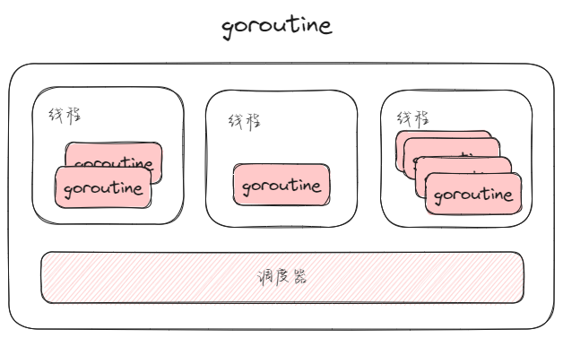
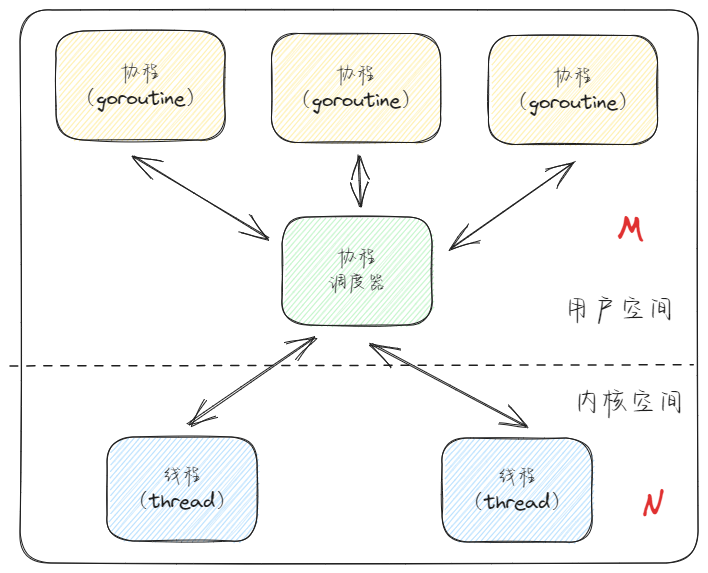
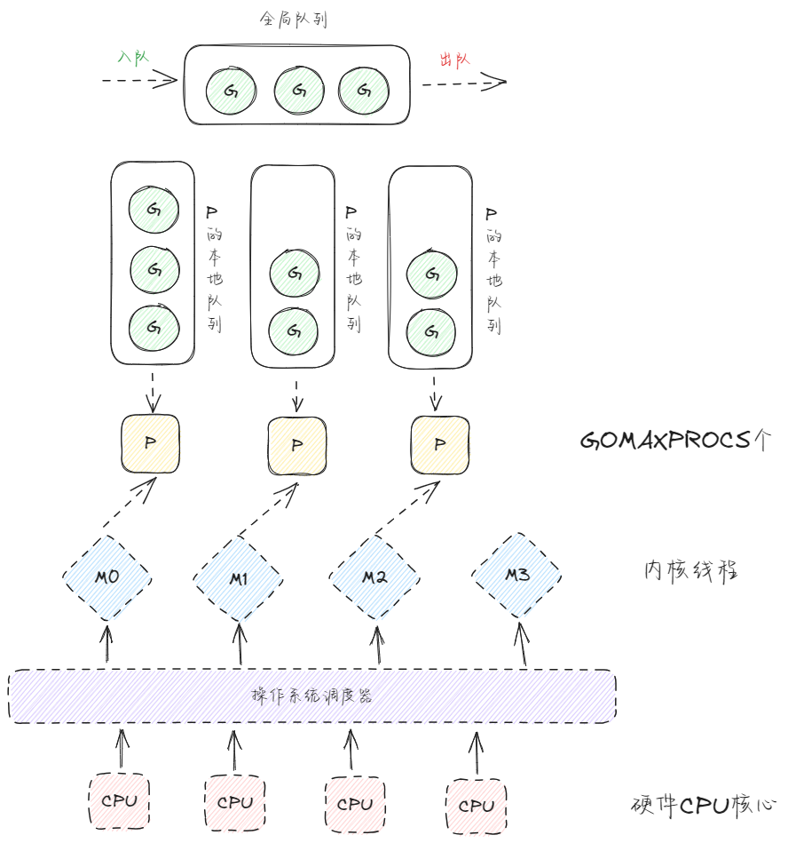

# Go语言并发编程

## 背景

在今天的数字时代，软件应用程序面临着处理大量数据和请求的挑战，这要求程序不仅要高效，还要能够并行处理多个任务。Go语言，作为一种现代编程语言，从其设计之初就将并发作为核心特性之一。通过其独特的并发模型，Go使得并发编程变得更加简单、安全，同时也更高效。

Go语言的并发模型基于"CSP（Communicating Sequential Processes）"理论，鼓励使用消息传递而非共享内存，这有助于避免并发编程中常见的竞态条件和死锁问题，主要通过goroutines和channels来实现。goroutine是Go中的轻量级线程，由Go运行时管理，可以用来执行并行任务。而channel则是goroutines之间的通信机制，它们使得数据的传递变得安全且简单。

## goroutines

在Go语言中，goroutine是实现并发编程的核心概念。goroutine是由Go运行时（runtime）管理的轻量级线程。它们在Go程序中用于执行函数或方法的并发操作。与操作系统线程相比，goroutine具有更小的内存占用，更快的启动时间，以及由Go运行时进行调度，从而提供了更高效的并发执行能力。



### **创建goroutine**

在Go中，通过在函数调用前加上`go`关键字来创建一个goroutine，从而使该函数能够并发执行。例如：

```go
go myFunction()
```

这会创建一个新的goroutine，与主goroutine（即`main`函数）并发执行`myFunction`函数。

### **特点**

- **轻量级**：goroutine在内存占用和初始化时间上都非常轻量，允许一个程序同时运行成千上万个goroutine。
- **动态栈**：goroutine的栈大小是动态的，可以根据需要增长和缩小，这与固定大小的操作系统线程栈形成对比。
- **非抢占式多任务处理**：goroutine的调度是协作式的，而不是抢占式的。这意味着Go运行时不会强制中断goroutine的执行，而是依赖goroutine自己主动让出CPU时间。
- **基于CSP模型**：goroutine间的通信推荐使用channel，这是一种遵循CSP（Communicating Sequential Processes）模型的通信方式，通过在goroutines之间发送消息来共享数据，而不是通过共享内存。

### Goroutine与线程的区别

- **轻量级**：Goroutines在内存占用上比线程更轻量级，启动时间也更短。
- **动态增长的栈**：Goroutine的栈大小是动态的，可以根据需要增长和缩小，而线程的栈大小通常在创建时固定。
- **调度**：Goroutines由Go运行时进行调度，不直接对应操作系统线程。Go运行时包含了自己的调度器，该调度器使用了M:N调度技术（多个Goroutines调度到多个操作系统线程上）。
- **并发简化**：Goroutines和通道（channels）的设计使得并发编程模型更加简单和高效。

### Goroutine调度器原理

Go 语言的 Goroutine 调度器是一个复杂且高效的系统，旨在允许成千上万的 Goroutines 并发执行，而不会像传统的线程那样消耗大量的系统资源。

**1. M:N 调度模型**



**2. G-P-M 模型**

- **G**（Goroutine）：代表一个并发执行的任务。
- **P**（Processor）：代表了对操作系统线程（M）的虚拟化，每个 P 维护一个本地的 Goroutine 队列。P 的数量通常由 GOMAXPROCS 环境变量控制，它决定了可以同时运行的 Goroutines 数量。
- **M**（Machine）：代表实际的操作系统线程，负责执行与 P 关联的 Goroutines。



**3. 调度过程**

- **Goroutine 创建**：当创建一个 Goroutine 时，它首先被放置在当前 P 的本地运行队列中。如果队列已满，它可能会被转移到全局队列或其他 P 的本地队列。
- **Goroutine 执行**：P 会从其本地队列中取出 Goroutine 并在绑定的 M 上执行。如果本地队列为空，P 可以从全局队列或从其他 P 偷取（work stealing）Goroutines 来执行。
- **系统调用和阻塞**：如果 Goroutine 进行系统调用或因其他原因阻塞，执行它的 M 可能会被阻塞。在这种情况下，P 会与当前 M 分离，并尝试获取一个新的 M 来继续执行其他 Goroutines。阻塞的 M 在系统调用返回后，会尝试重新获取一个 P 继续执行 Goroutines。
- **调度器的抢占**：为了防止长时间运行的 Goroutine 阻塞系统，Go 调度器实现了基于协作的抢占。这意味着运行时间过长的 Goroutine 会在安全点被抢占，以让出 CPU 给其他 Goroutine。

**4. 工作窃取**

为了平衡负载，空闲的 P 会尝试从其他 P 或全局队列中“窃取”Goroutines 来执行。这确保了即使某些 P 的本地队列为空，它们也可以继续执行工作，从而提高了整体的并发效率。

### **使用场景**

goroutine适用于任何需要并发处理的场景，如并行处理数据、实现高并发服务器等。由于其轻量级和高效的特性，goroutine在处理I/O操作、网络请求、并行计算等任务时表现出色。

## go channels


## 参考

1. https://zhuanlan.zhihu.com/p/681503315
2. https://www.cnblogs.com/SpriteLee/p/16620208.html
3. https://blog.csdn.net/qq_19283249/article/details/133959367
4. [GMP原理与调度](http://www.topgoer.com/%E5%B9%B6%E5%8F%91%E7%BC%96%E7%A8%8B/GMP%E5%8E%9F%E7%90%86%E4%B8%8E%E8%B0%83%E5%BA%A6.html)